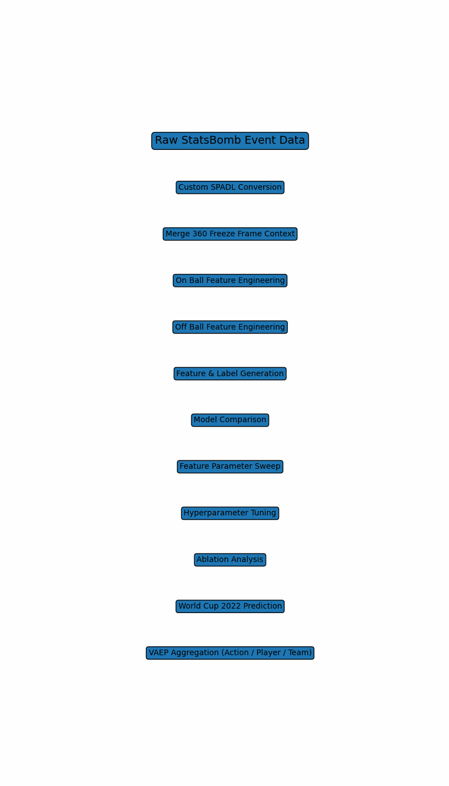

# Tracking Enhanced VAEP
Extending football action valuation with tracking-based spatial context, using StatsBomb 360 freeze frame data

## Key Results

Model selection best AUC
Score AUC 0.866
Concede AUC 0.842

World Cup 2022 out of sample evaluation
Full Tracking Model
Score AUC 0.8005
Concede AUC 0.8326

Without On Off Features
Score AUC 0.7998
Concede AUC 0.8307

Tracking derived spatial features provides consistent gains in both scoring and conceding tasks.

---

## What This Project Is

A reproducible end-to-end football action valuation pipeline that augments the original VAEP framework with StatsBomb 360 freeze frame context.

This repo is designed to demonstrate
sports domain understanding
tracking-based feature engineering
structured experimentation
tournament transferable evaluation
action, player, and team level outputs

---

## Pipeline Walkthrough

---

## Data

Training
Euro 2020

Out of sample evaluation
World Cup 2022

Source
StatsBomb event data plus StatsBomb 360 freeze frame

Note
StatsBomb 360 freeze frame does not always provide stable identifiers for all off-ball players, so off-ball contribution is best interpreted as a team-level context feature rather than a fully attributable individual off-ball credit assignment.

---

## Modelling Discipline

GroupKFold cross-validation by match to reduce leakage  
Strict tournament split between training and evaluation  
Feature parameter sweep before hyperparameter tuning  
Ablation analysis to isolate the marginal contribution of tracking features  

This mirrors production-grade workflows used in professional football analytics, betting feature pipelines, and model governance settings.

---

## Repository Structure

Suggested structure, adjust to match your repo layout

---

## How To Reproduce

Run notebooks in order

1, SPADL conversion  
`notebooks/1_my_SPADL_Converter.ipynb`

2, Merge 360 context and build on off-ball features  
`notebooks/2_On_Offball_Features_Merge.ipynb`

3, Convert to modelling features and labels  
`notebooks/3_Convert_into_Features_and_Labels.ipynb`

4, Model selection, feature sweep, tuning, prediction  
`notebooks/4_Paramtest_and_Pred_result.ipynb`

5, Experiments and reporting outputs  
`notebooks/5_Experiment.ipynb`

Outputs will be written into `outputs/` and include
model selection and sweep tables
World Cup 2022 prediction and evaluation files
VAEP action, player, team aggregates for each ablation variant

---

## Experiment Stages

Stage 1, Model selection  
`outputs/stage1_model_results.csv`

Stage 2, Structural feature sweep  
`outputs/stage2_feature_sweep_metrics.csv`  
Best setting  
`outputs/stage2_best_feature_combo.json`  
line_gap 5  
in_line_gap 5  
nr_actions 5  
model catboost

Stage 3, Hyperparameter tuning  
`outputs/stage3_hyperparam_results.csv`

Stage 4, Ablation analysis  
`outputs/stage4_ablation_metrics.csv`  
Full model vs No on off vs On only

---

## Why This Matters

Event-only valuation often ignores defensive structure and off-ball movement.  
By modelling defensive collapse patterns and dribble impact using freeze frame context, this pipeline supports

context-aware player valuation  
more robust team strength assessment  
feature inputs for betting models  
recruitment and scouting decision support  
match preparation benchmarking  

---

## Tech Stack

Python  
Pandas, NumPy  
Scikit learn  
CatBoost, XGBoost  
Notebook based modular pipeline

---

## Contact

If you are hiring for sports data science, football analytics, or betting modelling roles, feel free to reach out.

LinkedIn: https://www.linkedin.com/in/keunwoo-kim-78138820b/  
Email: mroptimister@gmail.com
